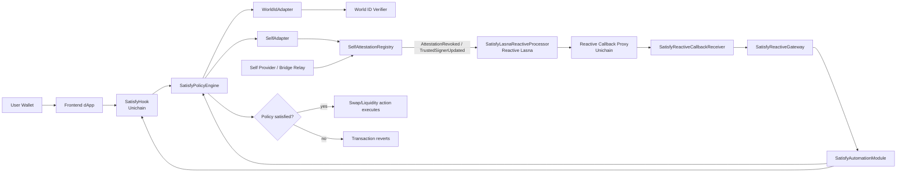

# Satisfy

**Minimum disclosure, maximum coordination.**

Satisfy is a credential-aware policy layer for Uniswap v4-style markets.
It gates participation on verifiable proofs, not wallet identity.

## Storyline: Fair Launch Under Fire

A DAO spins up a launch pool on Unichain Sepolia.

At first block, bot clusters start rotating wallets to farm rewards.
Normally, each fresh address looks like a fresh participant.
Satisfy changes the game: access is based on proof, not wallet cosmetics.

A real participant sends a proof bundle:

- World ID personhood proof (checked on-chain through verifier path)
- Self-derived eligibility attestation (bridged and stored in `SelfAttestationRegistry`)

The hook calls policy in real time before market execution:

- valid and in-policy: swap/liquidity action continues
- stale/replayed/revoked/out-of-policy: transaction is rejected

When risk signals appear (revocations, signer compromise), Reactive automation can rotate epoch or pause enforcement, so governance doesn’t rely on a centralized ops desk to react first.

This is the Satisfy thesis in production terms:

- prove what matters
- reveal nothing extra
- coordinate at market speed

## Production-Hardened Components

- `SatisfyPolicyEngine`
  - Adapter/policy registry, predicate logic (`AND`/`OR`), replay protection.
  - Global pause gate for emergency response.
- `SatisfyHook`
  - Pool-to-policy routing and policy enforcement at `beforeSwap` / `beforeAddLiquidity`.
  - Independent pause gate for market enforcement.
- `WorldIdAdapter`
  - On-chain verifier call path (`IWorldIdVerifier`) with strict domain-separated signal checks.
  - Freshness controls via `issuedAt`, `validUntil`, and `maxProofAge`.
- `SelfAttestationRegistry`
  - Domain-separated signer attestations with nonce replay protection.
  - Carries bridge reference metadata (`sourceChainId`, `sourceBridgeId`, `sourceTxHash`, `sourceLogIndex`).
  - Revocation and trusted signer rotation.
- `SelfAdapter`
  - Consumes only on-chain registry attestations.
  - Context binding to `(chainId, adapter, user, policyCondition)`.
- `SatisfyAutomationModule`
  - Role-gated control plane with reactive replay-protected jobs.
  - `REACTIVE_EXECUTOR_ROLE` is granted to `SatisfyReactiveGateway`, not an EOA.
  - Roles:
    - `POLICY_MANAGER_ROLE`
    - `ADAPTER_MANAGER_ROLE`
    - `HOOK_MANAGER_ROLE`
    - `REACTIVE_EXECUTOR_ROLE`
    - `EMERGENCY_ROLE`
- `SatisfyReactiveGateway`
  - On-chain ingress for hosted workers.
  - Verifies signed `JobV1` messages with chain/contract/automation domain separation.
  - Enforces worker nonce and digest replay protection before dispatching to automation.
- `SatisfyTimelock`
  - Safe-compatible proposer/executor timelock.
  - Intended to be role admin for governance hardening.

## Architecture Diagram

```text
                                    +----------------------+
                                    |   World ID Verifier  |
                                    +----------+-----------+
                                               |
                                               v
+-------------------+   proofs   +------------+-------------+
| User Wallet + UI  +----------->|  SatisfyHook (Unichain) |
+-------------------+            +------------+-------------+
                                               |
                                               v
                                  +------------+-------------+
                                  | SatisfyPolicyEngine      |
                                  | (policy + replay checks) |
                                  +------+--------------+-----+
                                         |              |
                                         v              v
                               +---------+--+     +-----+------------------+
                               |WorldIdAdapter|     |SelfAdapter            |
                               +---------+----+     +-----+-----------------+
                                         |                |
                                         |                v
                                         |      +---------+------------------+
                                         |      |SelfAttestationRegistry     |
                                         |      |(bridged attestations)      |
                                         |      +---------+-------------------+
                                         |                |
                                         |         events v
                                         |      +---------+-------------------+
                                         |      |Reactive Network (Lasna)     |
                                         |      |SatisfyLasnaReactiveProcessor|
                                         |      +---------+-------------------+
                                         |                |
                                         |       callback v
                                         |      +---------+-------------------+
                                         |      |SatisfyReactiveCallbackReceiver|
                                         |      +---------+-------------------+
                                         |                |
                                         |                v
                                         |      +---------+-------------------+
                                         |      |SatisfyReactiveGateway       |
                                         |      +---------+-------------------+
                                         |                |
                                         |                v
                                         |      +---------+-------------------+
                                         +----->|SatisfyAutomationModule      |
                                                +---------+-------------------+
                                                          |
                                                +---------+-------------------+
                                                |Policy/Hook lifecycle updates|
                                                +-----------------------------+
```

## Mermaid End-to-End Flow



## Local Quickstart

Prereqs:

- Foundry (`forge`, `cast`, `anvil`)
- `bash`

Build and test:

```bash
forge build --offline
forge test --offline
```

Run local E2E (deploy + policy + proofs + hook execution + replay + epoch + pause):

```bash
./script/anvil_e2e.sh
```

## Unichain Deployment

```bash
cp script/.env.unichain.example .env.unichain
source .env.unichain
UNICHAIN_NETWORK=sepolia ./script/deploy_unichain.sh
```

Supported networks:

- `sepolia` (`chainId=1301`)
- `mainnet` (`chainId=130`)

Deployment output includes:

- core contract addresses
- governance/timelock role config
- verifier + registry config
- deployment artifact JSON

Safe-first default:

- set `SAFE_ADDRESS` in `.env.unichain` to use Safe as default for automation owner, timelock admin/proposer/executor, and emergency actor.

## Reactive Network Integration (Lasna Event Plane)

Core Satisfy contracts stay on Unichain. Reactive Network is used to watch emitted events and execute callbacks back into Unichain:

1. Deploy core contracts to Unichain (`deploy_unichain.sh`).
2. Deploy reactive integration contracts:
   - `SatisfyReactiveCallbackReceiver` on Unichain
   - `SatisfyLasnaReactiveProcessor` on Lasna testnet
3. Wire callback authorization on `SatisfyReactiveGateway`.

```bash
source .env.unichain
DEPLOYER_PK=0x... \
LASNA_DEPLOYER_PK=0x... \
./script/deploy_reactive_pipeline.sh deployments/unichain-sepolia.json
```

Default Lasna RPC: `https://lasna-rpc.rnk.dev`.

Reference: [`docs/REACTIVE_NETWORK_LASNA.md`](docs/REACTIVE_NETWORK_LASNA.md)

### Execution Path

1. `SelfAttestationRegistry` emits lifecycle events on Unichain.
2. `SatisfyLasnaReactiveProcessor` (Lasna) subscribes and emits Reactive callbacks.
3. Reactive callback proxy calls `SatisfyReactiveCallbackReceiver` on Unichain.
4. Receiver dispatches into `SatisfyReactiveGateway.executeFromReactiveCallback(...)`.
5. Gateway enforces callback authorization + replay guards and executes automation action.

### Live Testnet Snapshot (March 9, 2026)

Unichain Sepolia (`chainId=1301`):

- `PolicyEngine`: `0x7d4A7CD841ADF25a6b044066Aa8cd5f16B326e6F`
- `Hook`: `0xc7c1fBcCe7A0Bc8bE8bb4F58F1177F3B67343741`
- `SelfRegistry`: `0xD88C3EaC6DE6583218EA46862f8fEB5506E470f1`
- `ReactiveGateway`: `0xC70B4A3525c1Cd6eBef2715FE4ed942D79aCd38F`
- `ReactiveCallbackReceiver`: `0x236baa6AEb458d7b91d7863ccE06FDd34020AecE`

Reactive Lasna (`chainId=5318007`):

- `SatisfyLasnaReactiveProcessor`: `0x2Be10838793F745f0E3550193C4720e9870e9E76`

Current callback proxy used for Unichain Sepolia:

- `destinationCallbackSender`: `0x4d7d194675E6844f7E23C1e830d6A03071DF4f4D`

## Relay Mock (Bridged Attestation Path)

Post a testnet attestation into `SelfAttestationRegistry` using domain-separated signature + nonce protection:

```bash
RPC_URL=https://sepolia.unichain.org \
RELAYER_PK=0x... \
RELAY_SIGNER_PK=0x... \
SELF_REGISTRY=0x... \
SUBJECT=0x... \
CONTEXT=0x... \
./script/relay_self_attestation_mock.sh
```

This outputs a ready-to-use `VITE_SELF_PROOF_PAYLOAD` value for frontend tests.

## Reactive Hosted Worker Pipeline

Run the worker loop that watches registry events and submits signed jobs to `SatisfyReactiveGateway.execute(...)`:

```bash
source .env.unichain
export REACTIVE_WORKER_PK=0x...
export REACTIVE_RELAYER_PK=0x...
./script/reactive_event_executor.sh deployments/unichain-sepolia.json
```

Behavior:

- revocation events can rotate epoch
- signer disable events can trigger emergency pause
- optional timer can rotate epoch
- all lifecycle mutations flow through gateway-verified worker signatures

Reference: [`docs/REACTIVE_EXECUTOR.md`](docs/REACTIVE_EXECUTOR.md)

## Unichain Smoke Validation

After deployment, run governance + optional fixture replay checks:

```bash
./script/unichain_smoke.sh deployments/unichain-sepolia.json
```

Optional fixture replay inputs:

- `SMOKE_USER`
- `WORLD_PROOF_PAYLOAD`
- `SELF_ATTESTATION_PAYLOAD`
- `SELF_ATTESTATION_SIGNATURE`
- `SELF_PROOF_PAYLOAD`

## Frontend

```bash
cp frontend/.env.example frontend/.env.local
npm --prefix frontend install
npm --prefix frontend run dev
```

The UI supports:

- `satisfies()`
- `beforeSwap()`
- proof payload schema validation for `WorldIdProofV1` and `SelfAttestationProofV1`

### Deployment Artifact Import

Copy deployment artifacts into frontend static assets:

```bash
./script/sync_frontend_artifact.sh deployments/unichain-sepolia.json
```

Then set:

```bash
VITE_UNICHAIN_SEPOLIA_DEPLOYMENT_ARTIFACT=/deployments/unichain-sepolia.json
```

## CI and Real-Data Replay

CI runs:

- full Foundry tests
- local anvil E2E script
- frontend lint/build
- real-data replay lane
- optional Unichain smoke lane (when Unichain smoke secrets are configured)

Real-data lane replays recorded provider fixtures from CI secrets:

```bash
./script/ci_real_data_replay.sh
```

Expected secret:

- `REALDATA_FIXTURE_JSON_B64`
- optional:
  - `UNICHAIN_SMOKE_DEPLOYMENT_B64`
  - `UNICHAIN_SMOKE_RPC_URL`
  - `UNICHAIN_SMOKE_USER`
  - `UNICHAIN_SMOKE_WORLD_PROOF_PAYLOAD`
  - `UNICHAIN_SMOKE_SELF_ATTESTATION_PAYLOAD`
  - `UNICHAIN_SMOKE_SELF_ATTESTATION_SIGNATURE`
  - `UNICHAIN_SMOKE_SELF_PROOF_PAYLOAD`
  - `UNICHAIN_SMOKE_RELAYER_PK`

Fixture schema example: [`docs/real_data_fixture.example.json`](docs/real_data_fixture.example.json).  
Encoding reference: [`docs/REAL_DATA_FIXTURE.md`](docs/REAL_DATA_FIXTURE.md).

To build a fixture JSON + base64 value locally:

```bash
./script/build_realdata_fixture.sh
```

## Repository Layout

- `src/` contracts
- `test/` unit + integration + replay tests
- `script/deploy_unichain.sh` Unichain deployment pipeline
- `script/deploy_reactive_pipeline.sh` deploys Lasna reactive processor + Unichain callback receiver
- `script/anvil_e2e.sh` local full-path protocol test
- `script/relay_self_attestation_mock.sh` mock bridge relay submission
- `script/ci_real_data_replay.sh` CI replay lane
- `script/ci_unichain_smoke.sh` CI smoke runner for deployed Unichain artifact
- `script/build_realdata_fixture.sh` fixture bundler for CI secret generation
- `script/unichain_smoke.sh` testnet smoke assertions + fixture replay
- `script/reactive_event_executor.sh` hosted-worker compatible event daemon (submits signed jobs to gateway)
- `frontend/` React + Vite app
- `docs/` runbooks and deployment docs

## License

MIT
